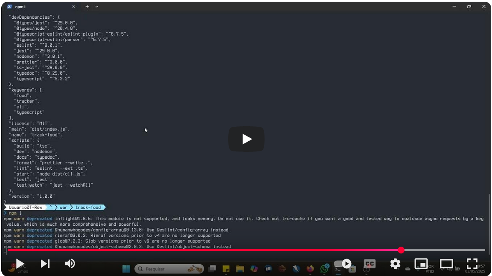

# 🚀 Zion CLI

Uma ferramenta de scaffolding moderna que utiliza IA para gerar estruturas de projetos em qualquer linguagem de programação, com foco em boas práticas e modularidade.

[](https://youtu.be/IHp77Qb76Ho)

## ✨ Características

- 🤖 **Integração com IA** - Utiliza Gemini, GPT ou OpenRouter para gerar estruturas inteligentes
- 🔌 **Sistema de Plugins** - Arquitetura extensível através de plugins
- 🌍 **Multi-linguagem** - Suporte a qualquer linguagem de programação
- 📦 **Scaffolding Inteligente** - Estruturas otimizadas para cada tipo de projeto
- 🛠️ **Configurável** - Personalizável através de plugins e configurações
- 🪟 **Suporte a Windows** - Funciona perfeitamente em ambientes Windows

## 🚦 Começando

### Pré-requisitos

- Go 1.20 ou superior
- Chave de API de pelo menos um provedor de IA:
  - Gemini (gratuita)
  - OpenAI GPT (paga)
  - OpenRouter (gratuita e paga)

### Instalação

Você tem duas opções para instalar o Zion:

#### 1. Via go install (Recomendado)

```bash
go install github.com/ktfth/zion@latest

# Configure o ambiente (cria diretórios necessários e plugin de exemplo)
zion setup
```

#### 2. Compilando do Fonte

```bash
# Clone o repositório
git clone https://github.com/ktfth/zion/.git

# Entre no diretório
cd zion

# Compile o projeto
go build

# Configure o ambiente (cria diretórios necessários e plugin de exemplo)
./zion setup
```

### Configuração

O Zion suporta três provedores de IA: **Gemini**, **GPT** e **OpenRouter**. Você pode configurar qualquer um deles:

#### 🤖 Gemini (Google) - Gratuito

1. Obtenha uma chave de API do Gemini em: https://makersuite.google.com/app/apikey
2. Configure a chave de API:
   ```bash
   # Windows PowerShell
   $env:GEMINI_API_KEY="sua-chave-aqui"
   
   # Linux/macOS
   export GEMINI_API_KEY="sua-chave-aqui"
   ```
3. Configure como provider padrão:
   ```bash
   # Windows PowerShell
   $env:ZION_AI_PROVIDER="gemini"
   
   # Linux/macOS
   export ZION_AI_PROVIDER="gemini"
   ```

#### 🧠 GPT (OpenAI) - Pago

1. Obtenha uma chave de API do OpenAI em: https://platform.openai.com/account/api-keys
2. Configure a chave de API:
   ```bash
   # Windows PowerShell
   $env:OPENAI_API_KEY="sua-chave-aqui"
   
   # Linux/macOS
   export OPENAI_API_KEY="sua-chave-aqui"
   ```
3. Configure o modelo padrão (opcional):
   ```bash
   # Windows PowerShell
   $env:OPENAI_MODEL="gpt-4o"
   
   # Linux/macOS
   export OPENAI_MODEL="gpt-4o"
   ```
4. Configure o número máximo de tokens (opcional):
   ```bash
   # Windows PowerShell
   $env:OPENAI_MAX_TOKENS="2048"
   
   # Linux/macOS
   export OPENAI_MAX_TOKENS="2048"
   ```
5. Configure a temperatura (opcional):
   ```bash
   # Windows PowerShell
   $env:OPENAI_TEMPERATURE="0.7"
   
   # Linux/macOS
   export OPENAI_TEMPERATURE="0.7"
   ```
6. Configure como provider padrão:
   ```bash
   # Windows PowerShell
   $env:ZION_AI_PROVIDER="gpt"
   
   # Linux/macOS
   export ZION_AI_PROVIDER="gpt"
   ```

#### 🌐 OpenRouter - Gratuito e Pago

OpenRouter oferece acesso a múltiplos modelos de IA, incluindo opções gratuitas e pagas.

1. Obtenha uma chave de API do OpenRouter em: https://openrouter.ai/keys
2. Configure a chave de API:
   ```bash
   # Windows PowerShell
   $env:OPENROUTER_API_KEY="sk-or-v1-sua-chave-aqui"
   
   # Linux/macOS
   export OPENROUTER_API_KEY="sk-or-v1-sua-chave-aqui"
   ```
3. Configure o modelo (opcional):
   ```bash
   # Windows PowerShell
   # Modelo gratuito (padrão)
   $env:OPENROUTER_MODEL="meta-llama/llama-3.2-3b-instruct:free"
   
   # Modelo pago de alta qualidade
   $env:OPENROUTER_MODEL="anthropic/claude-3-haiku"
   
   # Linux/macOS
   # Modelo gratuito (padrão)
   export OPENROUTER_MODEL="meta-llama/llama-3.2-3b-instruct:free"
   
   # Modelo pago de alta qualidade
   export OPENROUTER_MODEL="anthropic/claude-3-haiku"
   ```
4. Configure o número máximo de tokens (opcional):
   ```bash
   # Windows PowerShell
   $env:OPENROUTER_MAX_TOKENS="2048"
   
   # Linux/macOS
   export OPENROUTER_MAX_TOKENS="2048"
   ```
5. Configure a temperatura (opcional):
   ```bash
   # Windows PowerShell
   $env:OPENROUTER_TEMPERATURE="0.7"
   
   # Linux/macOS
   export OPENROUTER_TEMPERATURE="0.7"
   ```
6. Configure como provider padrão:
   ```bash
   # Windows PowerShell
   $env:ZION_AI_PROVIDER="openrouter"
   
   # Linux/macOS
   export ZION_AI_PROVIDER="openrouter"
   ```

##### 🎯 Modelos Populares no OpenRouter

**Gratuitos:**
- `meta-llama/llama-3.2-3b-instruct:free` - Llama 3.2 3B (padrão)
- `qwen/qwen-2-7b-instruct:free` - Qwen 2 7B

**Pagos (Alta Qualidade):**
- `anthropic/claude-3-haiku` - Claude 3 Haiku
- `openai/gpt-3.5-turbo` - GPT-3.5 Turbo
- `openai/gpt-4` - GPT-4
- `google/gemini-pro` - Gemini Pro
- `meta-llama/llama-3.1-8b-instruct` - Llama 3.1 8B

## 📚 Uso

### Gerenciar Provedores de IA

Antes de gerar projetos, você pode gerenciar e configurar os provedores de IA:

```bash
# Listar todos os provedores disponíveis
zion provider list

# Ver qual provider está atualmente ativo
zion provider current

# Ver instruções de configuração para um provider específico
zion provider config gemini      # Para Gemini
zion provider config gpt         # Para GPT
zion provider config openrouter  # Para OpenRouter

# Testar a conexão com um provider (após configurar)
zion provider test gemini
zion provider test gpt
zion provider test openrouter
```

### Gerar um novo projeto

#### Usando o provider configurado como padrão

```bash
# Sintaxe básica
zion scaffold -l <linguagem> -n <nome-projeto> -d "<descrição>"

# Exemplo: Criar uma API GraphQL em TypeScript
zion scaffold -l typescript -n minha-api -d "API GraphQL com autenticação e banco de dados"
```

#### Especificando provider e configurações na linha de comando

```bash
# Usar OpenRouter com API key específica
zion scaffold -l python -n meu-projeto -d "API REST com FastAPI" \
  -p openrouter -k "sk-or-v1-sua-chave-aqui"

# Usar OpenRouter com modelo específico
zion scaffold -l javascript -n frontend-app -d "App React moderno" \
  -p openrouter -k "sk-or-v1-sua-chave-aqui" -m "anthropic/claude-3-haiku"

# Usar GPT com configurações específicas
zion scaffold -l go -n api-server -d "API REST em Go" \
  -p gpt -k "sk-sua-chave-openai" -m "gpt-4"

# Usar Gemini
zion scaffold -l rust -n cli-tool -d "Ferramenta CLI em Rust" \
  -p gemini -k "sua-chave-gemini"
```

### Comandos Disponíveis

#### Comando `zion provider`
- `zion provider list` - Lista todos os provedores disponíveis
- `zion provider current` - Mostra o provider atualmente ativo
- `zion provider config <provider>` - Mostra instruções de configuração
- `zion provider test <provider>` - Testa a conexão com o provider

#### Comando `zion scaffold`
- `-l, --language` - Linguagem do projeto (obrigatório)
- `-n, --name` - Nome do projeto (obrigatório)
- `-d, --description` - Descrição do projeto (opcional)
- `-p, --provider` - Provider de IA (gemini, gpt, openrouter)
- `-k, --api-key` - API key específica para o provider
- `-m, --model` - Modelo específico do provider

#### Outros comandos
- `zion setup` - Configura o ambiente inicial
- `zion --help` - Mostra ajuda geral
- `zion <comando> --help` - Mostra ajuda específica de um comando

## 📊 Comparação de Provedores

| Característica | Gemini | GPT (OpenAI) | OpenRouter |
|---------------|---------|--------------|------------|
| **Custo** | Gratuito | Pago | Gratuito + Pago |
| **Qualidade** | Boa | Excelente | Varia por modelo |
| **Velocidade** | Rápida | Rápida | Varia por modelo |
| **Modelos** | Gemini 2.0 Flash | GPT-3.5/4 | 50+ modelos |
| **Limite gratuito** | Generoso | Não | Limitado |
| **Configuração** | Simples | Simples | Flexível |
| **Uso recomendado** | Pessoal/Aprendizado | Profissional | Experimental/Flexível |

### Quando usar cada provider

#### 🤖 Gemini
- ✅ Projetos pessoais
- ✅ Aprendizado e experimentação
- ✅ Prototipagem rápida
- ✅ Sem restrições de orçamento

#### 🧠 GPT (OpenAI)
- ✅ Projetos profissionais
- ✅ Qualidade consistente
- ✅ Suporte oficial
- ✅ Documentação extensa

#### 🌐 OpenRouter
- ✅ Experimentação com múltiplos modelos
- ✅ Acesso a modelos de ponta
- ✅ Flexibilidade de escolha
- ✅ Opções gratuitas e pagas

## 🚀 Exemplos Práticos

### Exemplo 1: Configuração Completa do OpenRouter

```bash
# 1. Configurar as variáveis de ambiente
export OPENROUTER_API_KEY="sk-or-v1-sua-chave-aqui"
export ZION_AI_PROVIDER="openrouter"
export OPENROUTER_MODEL="anthropic/claude-3-haiku"

# 2. Testar a configuração
zion provider test openrouter

# 3. Gerar um projeto
zion scaffold -l typescript -n ecommerce-app -d "Aplicação de e-commerce completa com React, TypeScript e Node.js"
```

### Exemplo 2: Usando Modelo Gratuito do OpenRouter

```bash
# Usar modelo gratuito diretamente na linha de comando
zion scaffold -l python -n ml-project -d "Projeto de Machine Learning com análise de dados" \
  -p openrouter \
  -k "sk-or-v1-sua-chave-aqui" \
  -m "meta-llama/llama-3.2-3b-instruct:free"
```

### Exemplo 3: Comparando Provedores

```bash
# Gerar o mesmo projeto com diferentes provedores
zion scaffold -l go -n api-rest -d "API REST com autenticação JWT" -p gemini -k "sua-chave-gemini"
zion scaffold -l go -n api-rest-gpt -d "API REST com autenticação JWT" -p gpt -k "sua-chave-openai"
zion scaffold -l go -n api-rest-openrouter -d "API REST com autenticação JWT" -p openrouter -k "sk-or-v1-sua-chave"
```

### Exemplo 4: Workflow Completo

```bash
# 1. Verificar provedores disponíveis
zion provider list

# 2. Configurar OpenRouter
zion provider config openrouter

# 3. Testar conexão
zion provider test openrouter

# 4. Gerar projeto com configurações específicas
zion scaffold \
  -l javascript \
  -n fullstack-app \
  -d "Aplicação fullstack com Next.js, API REST e banco de dados PostgreSQL" \
  -p openrouter \
  -k "sk-or-v1-sua-chave-aqui" \
  -m "anthropic/claude-3-haiku"

# 5. Verificar o projeto gerado
cd fullstack-app
ls -la
```

## 💡 Dicas e Recomendações

### Escolha do Provider

- **Gemini**: Gratuito, bom para projetos pessoais e aprendizado
- **GPT**: Pago, excelente qualidade, ideal para projetos profissionais
- **OpenRouter**: Flexível, oferece tanto opções gratuitas quanto pagas

### Modelos Recomendados por Uso

#### Para Desenvolvimento Pessoal/Aprendizado:
- `meta-llama/llama-3.2-3b-instruct:free` (OpenRouter - Gratuito)
- Gemini (Google - Gratuito)

#### Para Projetos Profissionais:
- `anthropic/claude-3-haiku` (OpenRouter - Pago)
- `openai/gpt-4` (OpenRouter/OpenAI - Pago)
- `gpt-3.5-turbo` (OpenAI - Pago)

#### Para Projetos Complexos:
- `openai/gpt-4` (Máxima qualidade)
- `anthropic/claude-3-sonnet` (OpenRouter - Pago)

### Configuração de Variáveis de Ambiente

Para facilitar o uso, você pode criar um script de configuração:

```bash
# setup-zion.sh (Linux/macOS)
#!/bin/bash
export OPENROUTER_API_KEY="sk-or-v1-sua-chave-aqui"
export ZION_AI_PROVIDER="openrouter"
export OPENROUTER_MODEL="anthropic/claude-3-haiku"
export OPENROUTER_MAX_TOKENS="4096"
export OPENROUTER_TEMPERATURE="0.7"
```

```powershell
# setup-zion.ps1 (Windows PowerShell)
$env:OPENROUTER_API_KEY="sk-or-v1-sua-chave-aqui"
$env:ZION_AI_PROVIDER="openrouter"
$env:OPENROUTER_MODEL="anthropic/claude-3-haiku"
$env:OPENROUTER_MAX_TOKENS="4096"
$env:OPENROUTER_TEMPERATURE="0.7"
```

## 🔌 Sistema de Plugins

O Zion possui um sistema de plugins robusto que permite estender suas funcionalidades:

### Tipos de Plugins

1. **Plugins Estáticos** (Windows)
   - Implementados diretamente no código fonte
   - Requerem recompilação do Zion

2. **Plugins Dinâmicos** (Linux/macOS)
   - Arquivos `.so` carregados em tempo de execução
   - Podem ser adicionados sem recompilação

### Hooks Disponíveis

- `BeforeGeneration` - Executado antes da geração do scaffold
- `ModifyPrompt` - Permite modificar o prompt enviado à IA
- `AfterGeneration` - Executado após a geração do scaffold

### Diretório de Plugins

- Windows: `%APPDATA%\Local\Zion\plugins`
- Linux/macOS: `~/.github.com/ktfth/zion/plugins`

## 🤝 Contribuindo

1. Fork o projeto
2. Crie sua branch de feature (`git checkout -b feature/AmazingFeature`)
3. Commit suas mudanças (`git commit -m 'Add: nova funcionalidade'`)
4. Push para a branch (`git push origin feature/AmazingFeature`)
5. Abra um Pull Request

## 📝 Licença

Este projeto está sob a licença MIT. Veja o arquivo [LICENSE](LICENSE) para mais detalhes.

## 🆘 Suporte

- **Issues**: Use o GitHub Issues para reportar problemas
- **Documentação**: Consulte a [Wiki](link-para-wiki) para documentação detalhada
- **Exemplos**: Veja a pasta `examples/` para exemplos de uso

## ⚠️ Notas Importantes

1. **Plugins no Windows**: Os plugins são implementados estaticamente devido a limitações do Go com plugins dinâmicos no Windows
2. **Chaves de API**: É necessário configurar pelo menos um provedor de IA para o funcionamento da ferramenta
3. **Caracteres especiais**: Alguns caracteres especiais (como @ em pacotes npm) podem requerer tratamento especial
4. **OpenRouter**: 
   - Oferece modelos gratuitos e pagos
   - Requer conta no OpenRouter.ai
   - Modelos gratuitos têm limitações de uso
   - Verifique os preços dos modelos pagos antes de usar
5. **Seleção automática**: O Zion seleciona automaticamente o provider baseado nas chaves de API disponíveis:
   - Prioridade: GEMINI_API_KEY → OPENAI_API_KEY → OPENROUTER_API_KEY
   - Use `ZION_AI_PROVIDER` para forçar um provider específico

## 🔧 Troubleshooting

### Problemas Comuns

#### 1. "Provider não suportado: openrouter"
```bash
# Solução: Recompilar o projeto
go build -o zion.exe .

# Ou verificar se o provider está registrado
zion provider list
```

#### 2. "API key não configurada"
```bash
# Verificar se a variável de ambiente está definida
echo $OPENROUTER_API_KEY  # Linux/macOS
echo $env:OPENROUTER_API_KEY  # Windows PowerShell

# Ou usar a flag -k diretamente
zion scaffold -l go -n teste -p openrouter -k "sua-chave-aqui"
```

#### 3. "API retornou status 401"
- Verifique se a API key está correta
- Confirme se tem saldo/créditos (para modelos pagos)
- Teste com um modelo gratuito primeiro

#### 4. "API retornou status 429"
- Aguarde um pouco e tente novamente (rate limiting)
- Considere usar um modelo com menos demanda

#### 5. "Modelo não encontrado"
```bash
# Verificar modelos disponíveis no OpenRouter
# Usar modelos conhecidos como:
zion scaffold -l python -n teste -p openrouter -k "sua-chave" -m "meta-llama/llama-3.2-3b-instruct:free"
```

### Verificação de Configuração

```bash
# Verificar configuração atual
zion provider current

# Testar conexão
zion provider test openrouter

# Verificar todos os provedores
zion provider list
```

## 📚 Documentação Adicional

- [Guia Completo do OpenRouter](docs/openrouter.md) - Documentação detalhada do provider OpenRouter
- [Uso do OpenRouter na CLI](docs/openrouter_cli.md) - Exemplos práticos de uso
- [Resumo dos Providers](docs/providers_summary.md) - Comparação técnica entre providers
- [Implementação OpenRouter](docs/openrouter_implementation.md) - Detalhes técnicos da implementação

## 🔗 Links Úteis

- [OpenRouter.ai](https://openrouter.ai/) - Site oficial do OpenRouter
- [OpenRouter Models](https://openrouter.ai/models) - Lista de modelos disponíveis
- [OpenRouter Pricing](https://openrouter.ai/pricing) - Preços dos modelos
- [OpenAI API](https://platform.openai.com/) - Plataforma OpenAI
- [Google AI Studio](https://makersuite.google.com/) - Plataforma Gemini

---
⭐️ Se este projeto te ajudou, considere dar uma estrela!
